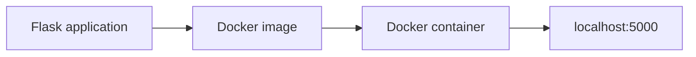

# DevOps Course Project

This project shows what I learned during the DevOps course and how I apply these skills in practice.


## Table of Contents

- [Project Goal](#project-goal)
- [Project Roadmap](#project-roadmap)
- [Project Structure](#project-structure)
- [How It Works](#how-it-works)
- [Application Endpoints](#application-endpoints)
- [Requirements](#requirements)
- [How to Run](#how-to-run)


## Project Goal

The goal of this project is to practice the theoretical knowledge from the course by building and running a simple application step by step.

The project covers tools and topics such as Docker, Docker Compose, Kubernetes, Git, Helm, Jenkins, and other DevOps practices.


## Project Roadmap

### Phase 1: Flask and Docker

- [x] Created a simple Flask application.
- [x] Added `requirements.txt` with the Python dependencies.
- [x] Added application endpoints: `/`, `/health`, and `/info`.
- [x] Added `.gitignore` to exclude local Python environment and cache files from Git.
- [x] Created a `Dockerfile` based on `python:3.12-slim`.
- [x] Added `.dockerignore` to keep the Docker build context clean.
- [x] Built and ran the application in a Docker container.
- [x] Added `docker-compose.yml` to run the application with Docker Compose.
- [x] Tagged and pushed the Docker image to Docker Hub.
- [x] Published the project source code to GitHub.

### Phase 2: Kubernetes

- [ ] Deploy the application to Kubernetes.
- [ ] Add Kubernetes manifests for Deployment, Service, ConfigMap, Secret, probes, HPA, and CronJob.

### Phase 3: Helm, Git, and Jenkins

- [ ] Create a Helm chart.
- [ ] Add Git workflow documentation.
- [ ] Add a Jenkins pipeline.


## Project Structure

- `app/app.py` - The main Flask application file. It creates the Flask app, defines the `/`, `/health`, and `/info` routes, and starts the app on port `5000`.
- `app/requirements.txt` - Contains the Python dependencies for the project. The Flask version is pinned to make the environment predictable.
- `Dockerfile` - Describes how to build the Docker image for the application: base image, working directory, dependencies, source code, and startup command.
- `docker-compose.yml` - Describes how to run the application as a Docker Compose service and maps port `5000` from the container to the host machine.
- `.gitignore` - Excludes local files such as `.venv` and Python cache files from the project repository.
- `.dockerignore` - Excludes local files such as `.git`, `.venv`, Python cache files, logs, and environment files from the Docker build context.


## How It Works



The Flask application is packaged into a Docker image.  
The image is used to run a container.  
Port `5000` inside the container is mapped to port `5000` on the host machine.


## Application Endpoints

The application provides three simple endpoints:

- `/` - Returns the main application response: `Hello, World!`
- `/health` - Returns application health status. This endpoint can be used later by Kubernetes liveness and readiness probes.
- `/info` - Returns basic application information such as name, version, and description.

Example checks:

```bash
curl http://localhost:5000/
curl http://localhost:5000/health
curl http://localhost:5000/info
```


## Requirements

- Docker
- Docker Compose

This project was tested on Windows with WSL and Docker Desktop.


## How to Run

### Option 1: Run with Docker Compose

This is the recommended way to run the project locally.

```bash
docker compose up
```

After the container starts, open:

```text
http://localhost:5000
```

Or test it with:

```bash
curl http://localhost:5000
```

To stop the service, press `Ctrl+C`.  
To remove the stopped Compose resources, run:

```bash
docker compose down
```

### Option 2: Run with Docker manually

Build the Docker image:

```bash
docker build -t quakewatch-learning .
```

Run the container:

```bash
docker run --rm --name quakewatch-app -p 5000:5000 quakewatch-learning
```

Then open:

```text
http://localhost:5000
```


### Option 3: Pull from Docker Hub

Pull the published image:

```bash
docker pull stanislavsupanitsky/quakewatch-learning:phase1
```


Run the pulled image:

```bash
docker run --rm --name quakewatch-app -p 5000:5000 stanislavsupanitsky/quakewatch-learning:phase1
```


Then open:

```text
http://localhost:5000
```


